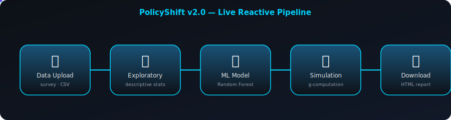

<div align="center">


<a href="https://salek.shinyapps.io/policyshift/">
  
</a>

</div>

<div align="center">

[](https://salek.shinyapps.io/policyshift/)
[](https://github.com/muhammadsalek/PolicyShift)
[](LICENSE)

</div>

<div align="center">


</div>

<p align="center">
  
</p>
<p align="center"><sub>Animated pipeline: data flows through Upload → Exploratory → ML Model → Simulation → Report in real time within the app.</sub></p>

---

## Overview

**PolicyShift** is an interactive **counterfactual policy simulation platform** that lets researchers and policy analysts test "what-if" scenarios on public health outcomes *before* committing real-world resources. Built on a **Random Forest machine learning engine** combined with **survey-weighted g-computation**, PolicyShift converts observational survey data (DHS/MICS-style) into an evidence-based decision-support tool — no coding required.

> Upload data → train the model → move a slider → watch the predicted health outcome shift in real time.

This repository contains the full source code for **PolicyShift v2.0 (Competition Edition)**, submitted as a showcase of applied biostatistics, causal inference, and full-stack R Shiny engineering — alongside the accompanying **Q1-journal manuscript** and **methodology flow diagram** documenting the underlying framework.

<div align="center">

### ⚡ Workflow at a Glance

</div>

| Step | Module | What Happens |
|:----:|:-------|:--------------|
| **1️⃣** | 📂 **Data Upload** | Load survey data with health outcomes (sample dataset included) |
| **2️⃣** | 📊 **Exploratory** | Auto-generated descriptive statistics & distribution plots |
| **3️⃣** | 🤖 **ML Model** | Random Forest trained with variable-importance ranking |
| **4️⃣** | 🔮 **Simulation** | Interactive sliders drive counterfactual g-computation |
| **5️⃣** | 📥 **Download** | One-click professional HTML report generation |

---

## Live Demo

<div align="center">

[](https://salek.shinyapps.io/policyshift/)

*Perfect for: policy analysts · public health researchers · government health officials · graduate methods courses*

</div>

---

## Key Features

<table>
<tr>
<td width="50%" valign="top">

**🔮 Simulation Engine**
- Counterfactual policy simulation via g-computation
- Individual-level counterfactual explanations
- Subgroup heterogeneity analysis (urban/rural, wealth quintile)

**🤖 Machine Learning**
- Random Forest classifier with variable-importance ranking
- Survey-weighted training pipeline
- Automated train/test validation with ROC/AUC diagnostics

</td>
<td width="50%" valign="top">

**📊 Visualization**
- Fully interactive Plotly graphics (zoom, hover, export)
- Real-time slider-driven outcome projection
- Dynamic importance & distribution charts

**📥 Reporting**
- One-click professional HTML report export
- Publication-style tables and figures
- Reproducible, shareable simulation summaries

</td>
</tr>
</table>

<p align="center">
  
</p>
<p align="center"><sub>Illustrative Random Forest variable-importance ranking as rendered in the 🤖 ML Model tab — bars animate in on load.</sub></p>

---

## Analysis Pipeline

```
Survey Data (Upload or Sample)
        │
        ▼  Cleaning · recoding · survey-weight assignment
  Data Upload Module        (📂 Data Upload tab)
        │
        ▼
  Exploratory Analysis      descriptive statistics · distribution plots
    (📊 EDA tab)             correlation diagnostics
        │
        ▼
  ML Model Training         Random Forest (survey-weighted)
    (🤖 Model tab)           variable-importance ranking · ROC/AUC
        │
        ▼
  Counterfactual Engine     g-computation · policy-slider inputs
    (🔮 Simulation tab)      individual-level counterfactual explanations
                             subgroup heterogeneity (urban/rural · wealth)
        │
        ▼
  Reporting                 interactive Plotly dashboards
    (📥 Download tab)        exportable HTML policy-impact report
```

---

## Author

**Md Salek Miah**  
Department of Statistics  
Shahjalal University of Science and Technology (SUST), Sylhet-3114, Bangladesh  
📧 [saleksta@gmail.com](mailto:saleksta@gmail.com)

[](https://orcid.org/0009-0005-5973-461X)
[](https://www.linkedin.com/in/md-salek-miah-b34309329/)
[](https://github.com/muhammadsalek)
[](https://www.youtube.com)

---

## Repository Structure

```
PolicyShift/
│
├── README.md                          ← This file
├── app.R                              ← Main Shiny application (UI + server logic)
│                                        public-health-policy-simulator: data upload,
│                                        EDA, Random Forest training, g-computation
│                                        simulation engine, and report export — all
│                                        modules live in this single reactive app
├── policyshift_sample_data.csv        ← Sample survey dataset for demo purposes
├── Work_flow.tiff                     ← Methodology flow diagram (data → model →
│                                        simulation → report pipeline)
├── PolicyShift_Q1_Journal_Paper.docx  ← Q1-standard manuscript describing the
│                                        methodology, validation, and competition
│                                        submission for PolicyShift v2.0
└── LICENSE                            ← MIT License
```

> **Note:** PolicyShift is intentionally packaged as a **single-file Shiny app** (`app.R`) for ease of deployment on shinyapps.io — all modules (data upload, EDA, ML training, simulation, and reporting) are organized as reactive sections within this one script.

---

## Methodology Flow

<div align="center">

</div>

The diagram above traces the full analytical pipeline — from raw survey data ingestion through Random Forest model training to counterfactual g-computation and final report generation — matching the five-tab structure of the live app (📂 Data Upload → 📊 Exploratory → 🤖 ML Model → 🔮 Simulation → 📥 Download).

---

## Manuscript

A **Q1-journal-standard manuscript** documenting the methodology, model validation, and simulation framework behind PolicyShift v2.0 is included in this repository:

[](PolicyShift_Q1_Journal_Paper.docx)

---

## Quick Start

**Requirements:** R `≥ 4.2` (tested on R 4.5.1)

```r
# Install required packages
packages <- c(
  "shiny", "shinydashboard", "randomForest", "survey",
  "plotly", "DT", "dplyr", "ggplot2", "rmarkdown"
)

installed <- packages %in% rownames(installed.packages())
if (any(!installed)) install.packages(packages[!installed], dependencies = TRUE)
invisible(lapply(packages, library, character.only = TRUE))

# Clone and launch the app locally
git clone https://github.com/muhammadsalek/PolicyShift.git
setwd("PolicyShift")
shiny::runApp("app.R")

# Or load the bundled sample dataset directly within the app's
# 📂 Data Upload tab: policyshift_sample_data.csv
```

Or simply try the hosted version — no installation required:

**👉 [https://salek.shinyapps.io/policyshift/](https://salek.shinyapps.io/policyshift/)**

---

## Methods Summary

| Component | Detail |
|:----------|:-------|
| **Platform** | R Shiny (reactive web application) |
| **ML Algorithm** | Random Forest with variable-importance ranking |
| **Causal Framework** | Counterfactual g-computation |
| **Weighting** | Survey-weighted estimation throughout |
| **Subgroup Analysis** | Urban/rural and wealth-quintile heterogeneity |
| **Explainability** | Individual-level counterfactual explanations |
| **Visualization** | Plotly (interactive), dynamic slider-linked charts |
| **Output** | Downloadable, publication-style HTML report |
| **Target Users** | Policy analysts, public health researchers, government officials |

---

## Related Publications

This tool builds on methodological work from a series of DHS-based analyses:

- **Nepal ECE (2026):** Miah MS et al. Household Water and Handwashing Facilities and Early Childhood Education Participation in Nepal. *Health Science Reports*, 9(4), e72254. [https://doi.org/10.1002/hsr2.72254](https://doi.org/10.1002/hsr2.72254)
- **Bangladesh Depression & Internet Use (2025):** Miah MS, Ullah MO. Associations of internet use and pregnancy loss with depression and anxiety among women in Bangladesh. *BMC Women's Health*, 26, 6. [https://doi.org/10.1186/s12905-025-04166-4](https://doi.org/10.1186/s12905-025-04166-4)
- **Lesotho Decision-Making Autonomy (2026):** Miah MS, Kabir MB. Decision-making autonomy and depressive symptoms among women in Lesotho. *Journal of Affective Disorders Reports*, 25. [https://doi.org/10.1016/j.jadr.2026.101080](https://doi.org/10.1016/j.jadr.2026.101080)

---

## Citation

If you use this tool or its methodology in your research, please cite the repository:

```bibtex
@misc{miah_policyshift_2026,
  author    = {Miah, Md Salek},
  title     = {PolicyShift v2.0: A Counterfactual Policy Simulation Platform
               for Public Health Decision-Making},
  year      = {2026},
  publisher = {GitHub},
  url       = {https://github.com/muhammadsalek/PolicyShift},
  note      = {International Competition Edition}
}
```

---

## Funding & Conflicts of Interest

This project received no specific funding. The author declares no conflicts of interest.

---

## License

MIT License — Copyright © 2026 Md Salek Miah  
Open for academic, research, and educational use. **Attribution required for any reuse.**

---

<div align="center">


**Biostatistics, Epidemiology & Applied Machine Learning**  
Department of Statistics · Shahjalal University of Science and Technology · Sylhet-3114, Bangladesh

[](https://r-project.org)
[](https://shiny.posit.co)
[](https://www.sust.edu)
[](https://creativecommons.org/licenses/by/4.0/)

*⭐ Star this repo if PolicyShift helped your research or teaching!*

</div>
